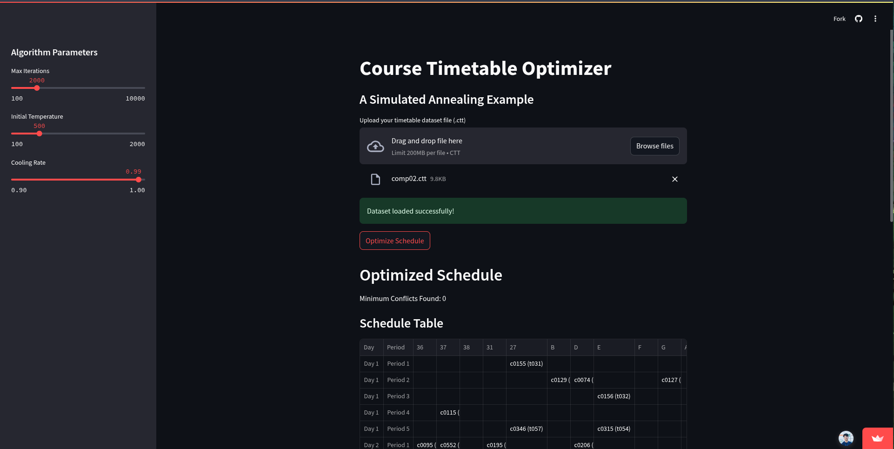
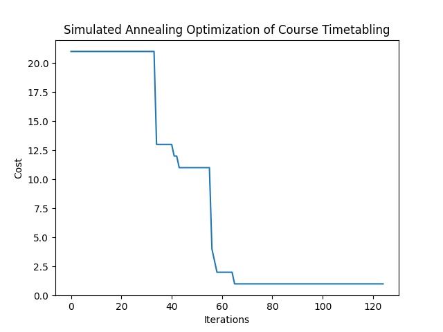

# Course Timetable Optimizer - Simulated Annealing Example



## Description

This project is a Streamlit web application that demonstrates the use of the **Simulated Annealing** algorithm to optimize course timetables. It takes a course timetable dataset in `.ctt` format as input and attempts to find a schedule that minimizes conflicts, such as scheduling courses in the same room at the same time or violating unavailability constraints.

The application provides a user-friendly interface built with Streamlit, allowing users to:

- **Upload their own timetable datasets.**
- **Adjust algorithm parameters** like maximum iterations, initial temperature, and cooling rate to control the optimization process.
- **Visualize the optimized schedule** in an interactive table.
- **Download the optimized schedule** as a text file.
- **Track the cost optimization progress** through a plot.

This project serves as a practical example of applying the Simulated Annealing algorithm to a real-world scheduling problem.

### Sample Cost Optimization Progress Plot



## How to Run

1. **Clone the repository:**

   ```bash
   git clone <repository_url>
   cd ai/simulated-annealing
   ```

2. **Set up a virtual environment (recommended):**

   ```bash
   python -m venv .venv
   source .venv/bin/activate  # On Linux/macOS
   .venv\Scripts\activate  # On Windows
   ```

3. **Install dependencies:**

   ```bash
   pip install -r requirements.txt
   ```

4. **Run the Streamlit application:**

   ```bash
   streamlit run main.py
   ```

   This will open the application in your web browser (usually at `http://localhost:8501`).

## Sample Datasets

The `sample_datasets` directory contains example timetable datasets in `.ctt` format. These files are text-based and describe:

- **Courses**: Course ID, teacher, number of lectures, number of students.
- **Rooms**: Room ID, capacity.
- **Curricula**: Groups of courses that should not be scheduled at the same time (e.g., courses for the same student group).
- **Unavailability Constraints**: Specific timeslots when a course cannot be scheduled.
- **Days and Periods per day**: Define the structure of the timetable.

You can upload these `.ctt` files or create your own datasets in the same format to test the optimizer.

Example `.ctt` file structure (snippet from `comp01.ctt`):

```ctt
Name: Fis0506-1
Courses: 30
Rooms: 6
Days: 5
Periods_per_day: 6
Curricula: 14
Constraints: 53

COURSES:
c0001 t000 6 4 130
c0002 t001 6 4 75
...

ROOMS:
B	200
C	100
...

CURRICULA:
q000  4 c0001 c0002 c0004 c0005
q001  4 c0014 c0015 c0016 c0017
...

UNAVAILABILITY_CONSTRAINTS:
c0001 4 0
c0001 4 1
...

END.
```


## Algorithm Parameters

The sidebar in the application allows you to adjust the following Simulated Annealing parameters:

- **Max Iterations**: The maximum number of iterations the algorithm will run. A higher number of iterations generally leads to better optimization but increases computation time.
- **Initial Temperature**: The starting temperature for the simulated annealing process. A higher initial temperature allows for greater exploration of the solution space.
- **Cooling Rate**: The rate at which the temperature decreases in each iteration. A cooling rate closer to 1 (e.g., 0.9999) cools slower, allowing more exploration, while a lower rate (e.g., 0.9) cools faster, potentially converging quicker but possibly to a local optimum.

Experiment with these parameters to see how they affect the optimization results for different datasets.

## Usage

1. **Upload Dataset:** Click on the "Browse files" button in the main panel to upload a `.ctt` timetable dataset file.
2. **Verify Dataset Load:** If the dataset is loaded successfully, a "Dataset loaded successfully!" message will appear. Check the error message if the dataset fails to load and ensure your `.ctt` file is correctly formatted.
3. **Adjust Algorithm Parameters (Optional):** Use the sliders in the sidebar to modify "Max Iterations", "Initial Temperature", and "Cooling Rate" if you want to customize the optimization process.
4. **Optimize Schedule:** Click the "Optimize Schedule" button. The application will start the Simulated Annealing algorithm to find an optimized timetable. A spinner will indicate that the optimization is in progress.
5. **View Optimized Schedule:** Once optimization is complete, the "Optimized Schedule" section will appear:
   - **Minimum Conflicts Found**: Displays the minimum number of conflicts found in the best schedule.
   - **Schedule Table**: Shows the optimized timetable in a tabular format, displaying courses scheduled in rooms across days and periods.
   - **Download Schedule as Text**: Click this button to download the optimized schedule as a `.txt` file.
   - **Cost Optimization Progress**: A plot shows how the cost (number of conflicts) decreased over iterations, illustrating the optimization process.

## Directory Structure

```
timetable-optimizer/
├── .venv/                 # Virtual environment directory (if created)
├── sample_datasets/       # Directory containing sample .ctt datasets
│   ├── comp01.ctt
│   ├── comp02.ctt
│   ├── ...
├── utils/                # Python utility modules
│   ├── __init__.py
│   ├── algorithm.py      # Simulated Annealing algorithm implementation
│   ├── data_loader.py    # Functions to load data from .ctt files
│   ├── schedule_display.py # Functions to display the schedule in Streamlit
│   └── schedule_generator.py # Functions to generate and modify schedules
├── main.py              # Main Streamlit application script
├── requirements.txt     # Project dependencies
└── readme.md            # This README file
```

## Dependencies

- `streamlit`: For creating the web application interface.
- `matplotlib`: For plotting the cost optimization progress.
- `pandas`: For creating and displaying dataframes in Streamlit.
- `numpy`: For numerical computations within the algorithm.

These dependencies are listed in the `requirements.txt` file.

